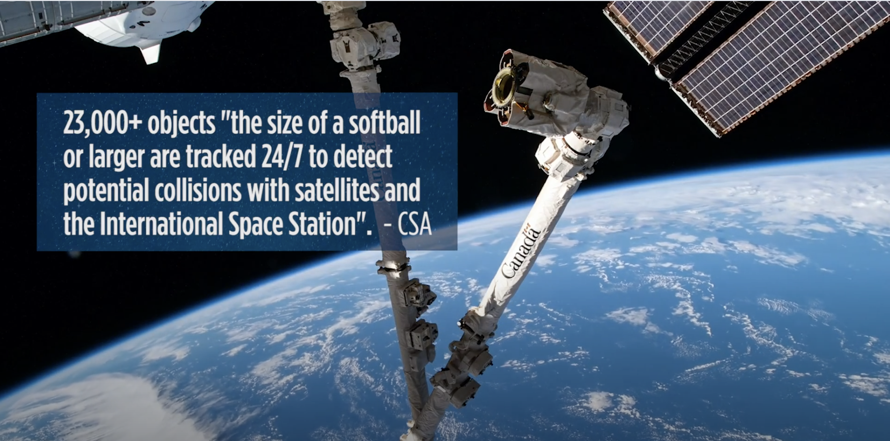

<style>

#TOC {
  margin-top: 40px;
  background: url("https://ewscripps.brightspotcdn.com/dims4/default/9d34d32/2147483647/strip/true/crop/1280x720+0+0/resize/1280x720!/quality/90/?url=http%3A%2F%2Fewscripps-brightspot.s3.amazonaws.com%2F42%2Fb3%2Ff10c7ff1498880ea9768df26cf47%2Fus-space-command.jpg");
  background-size: contain;
  padding-top: 165px !important;
  background-repeat: no-repeat;
  border: None;
  width: 1;
}

</style>
<center>
 
<br>

<b>Figure 1: </b>Screen shot of NASA video depicting hole in International Space State Canada Arm, discovered May 12, 2021. The damage was likely the result of colliding with space debris.<br><br>
</center>
<br>

<br>

```{r setUp, include=FALSE}
knitr::opts_chunk$set(
  cache=FALSE,
  message=FALSE,
  warning=FALSE,
  fig.align="center",
  class.source="chunk",
  out.width="100%",
  fig.retina = 3
)

library(data.table)
library(dplyr)
library(plotly)
library(RColorBrewer)
library(formattable)
options(scipen=99)

```

# Executive Summary
- Charged with informing the process to develop a debris on debris collision warning threshold to mitigate future collision risk and limit false alarms.<br><br>
- The study has focused on the following parameters:
    - **5, 4, and 3** days to time of closest approach (TCA).
    - Concern Events terminology defined as **Collision Probability** $\bf{\ge\text{.75 Superquantile}}$ within a day to TCA.<br><br>
- Final study implementations:
    - Removed all observations with $\bf{\le 1\text{e-}10}$ Collision Probability.
    - Tested **Warning Thresholds between** $\bf{1\text{e-7}\text{ and }1\text{e-5}}$.
    - Evaluated Missed Alert verse False Alarm risk at **5, 4 and 3** days to TCA.
    - Evaluated performance variability.<br><br> 
- Final conclusions:
    - Performance increases as days to TCA decreases.
    - Optimal Warning Thresholds depend on days to TCA.
    - Variability in Collision Probability decreases as days to TCA decreases.<br><br>

# Problem Formulation
- <b>Problem Statement:</b> Under what circumstances should debris-on-debris collision warnings be used?
    - What probability of collision should be used as a surrogate for an actual event of concern?
    - What probability of collision should trigger a warning at five, four and three days to TCA?
    - How well can we do in warning for events occurring in the future?<br><br>
- <b>Mission Statement:</b> Recommend debris collision notification thresholds and develop a mechanism to explore the notification decision space to assess risk of debris-on-debris collisions in space.<br><br>

# Exploratory Data Analysis 
- <b>Questions:</b>
    - How is the Collision Probability distributed?
    - How does the Collision Probability change over time?<br><br>
- <b>Data Preparation:</b>
    - Summarize by each event to show the Collision Probability for each fragment size at the last recorded time, if that time is within a day of TCA.
    - Summarize by each event to show the Collision Probability for each fragment size at the last recorded time, for each binned days to TCA.<br><br>

## Collision Probability Density
We need to find a range of values to appropriately label events of concern.

<br>

<center>
<b>Figure 2: Collision Probability within One Day of TCA</b>
</center>
<br>
```{r eda_plot1, echo=FALSE}
load("products/Pc_at_1_day.RData")
Pc_at_1_day
```

<br>

<center>
```{r severeTable, echo=FALSE}
load("data/debrisInfo.RData")
debrisInfo$concernProbs[,".75 Superquantile" := `.75 Superquantile` %>%
                          formatC(format="e",digits=2)]
debrisInfo$concernProbs %>% 
  formattable(align="l") %>% as.htmlwidget(width=400)
```
</center>

We use the .75 Superquantile for each fragment size as a surrogate to label a concern event [@rockafellar_superquantiles_2013]. 

<br>

## Collision Probability Variability

- Does the Collision Probability increase as we approach TCA?
- Should we expect to have a lower warning threshold at five days to TCA?

<br>

<center>
<b>Figure 3: Collision Probability as TCA Varies</b>
</center>
<br>
```{r eda_plot3, echo=FALSE}
load("products/Pc_delta.RData")
Pc_delta
```
<br>

<b>Conclusions:</b>

- The variability tightens slightly around 0 as TCA approaches.
- Some evidence of a slight decrease in Collision Probability as TCA approaches.
- No compelling evidence of a single optimal Warning Threshold for each Fragment Size.
- We use:

<br>

<center>
$\bf{1\text{e-7} \le Pc\_warn \le 1\text{e-5}}$,
</center>

<br>

where $\bf{Pc\_warn}$ is the Collision Probability that triggers a warning.

<br>

# Risk Tradespace {.tabset .tabset-fade}
We need to evaluate warning thresholds by examining the trade space between risk aversion and tolerance.

We have the following working definitions:
<br>

<align>
$\hspace{2.5cm}\bf{\text{Concern Event} := \text{Collision Probability} \ge 1\text{e-}5 \text{ and days to TCA < 1 day}}$
<br>
$\hspace{2.5cm}\bf{\text{False Negative (FN)} := \text{# of Concern Events in a year that did not trigger a warning}}$
<br>
$\hspace{2.5cm}\bf{\text{False Positive (FP)} := \text{# of False Alarms in a year}}$.
<br>
</align>

We can now explore how the warning threshold affects the $\text{FP}$ and $\text{FN}$.

<br>

## Five days to TCA

<center>
<b>Figure 4: Warning Performance at Five Days to TCA</b>
</center>

```{r concern_plot1, echo=FALSE}
load("products/finalPlots.RData")
concernCount_5_plot
```

## Four days to TCA

<center>
<b>Figure 5: Warning Performance at Four Days to TCA</b>
</center>

```{r concern_plot2, echo=FALSE}
concernCount_4_plot
```

## Three days to TCA

<center>
<b>Figure 6: Warning Performance at Three Days to TCA</b>
</center>

```{r concern_plot3, echo=FALSE}
concernCount_3_plot
```

# Recommended Thresholds  
Based on an even priority between Missed Events (FN) and False Alarms (FP), we found the following warning thresholds had the best performance with the observed data:

<center>
```{r recommendation, echo=FALSE}
load("products/finalPlots.RData")
final$finalRec %>% formattable(align="l") %>% as.htmlwidget(width=400)
```
</center>

## Performance

<center>
```{r recommendationPerformance, echo=FALSE}
final$finalPerformance %>% formattable(align="l") %>% as.htmlwidget(width=500)
```
</center>

# Performance with Uncertainty 
Taking the optimal warning thresholds for each fragment size and days to TCA, we evaluate the performance on random data samples, and computing the 95% Confidence Interval for FN and FP counts. The boxes indicate the 95% bounds and the dot is the observed performance.

<center>
<b>Figure 7: Warning Performance at Three, Four and Five Days to TCA</b>
</center>

```{r concern_plot4, echo=FALSE}
final$plot
```

# Final Conclusions
- .75 Superquantile is a conservative surrogate
- Warning Thresholds and Missed Tolerance should depend on Fragment Size, and Days to TCA
- Further analysis required to investigate high degree of variability in performance

<br><br><br><br>

# References
